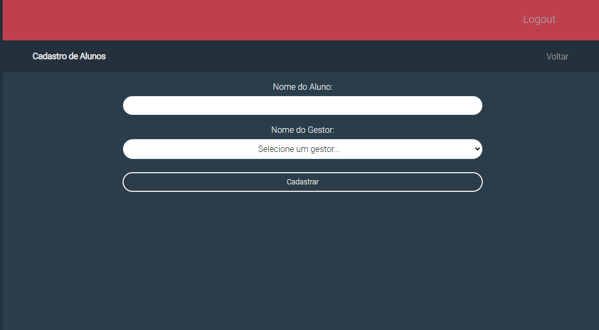
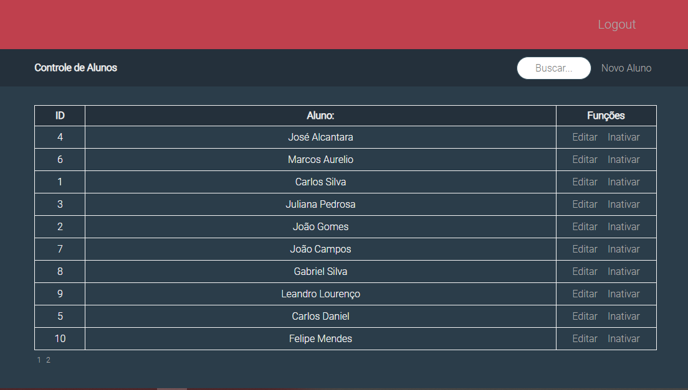

# Projeto para controle de cursos, alunos e matriculas.

Esse projeto foi desenvolvido em React com Typescript e Backend em Django Rest Framework.
## Front End
1. Estilização com Css, Grid e Flexbox.

## Back End
1. Postgres
2. Autenticação via Token.

_logo omitido_

